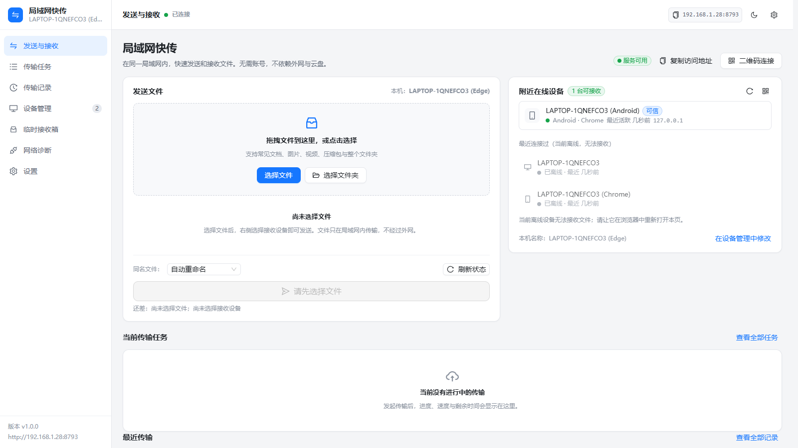
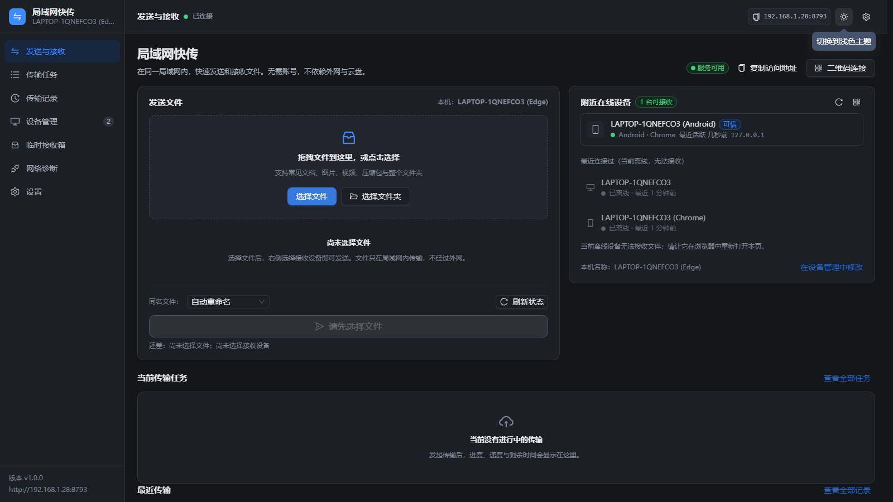
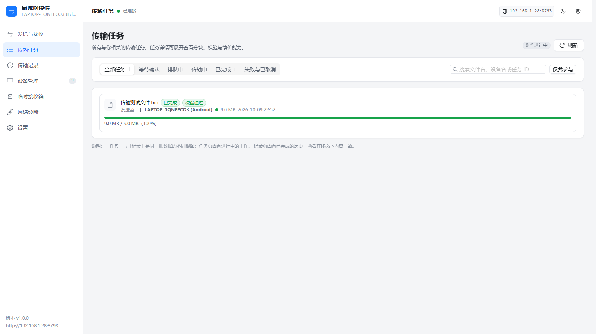
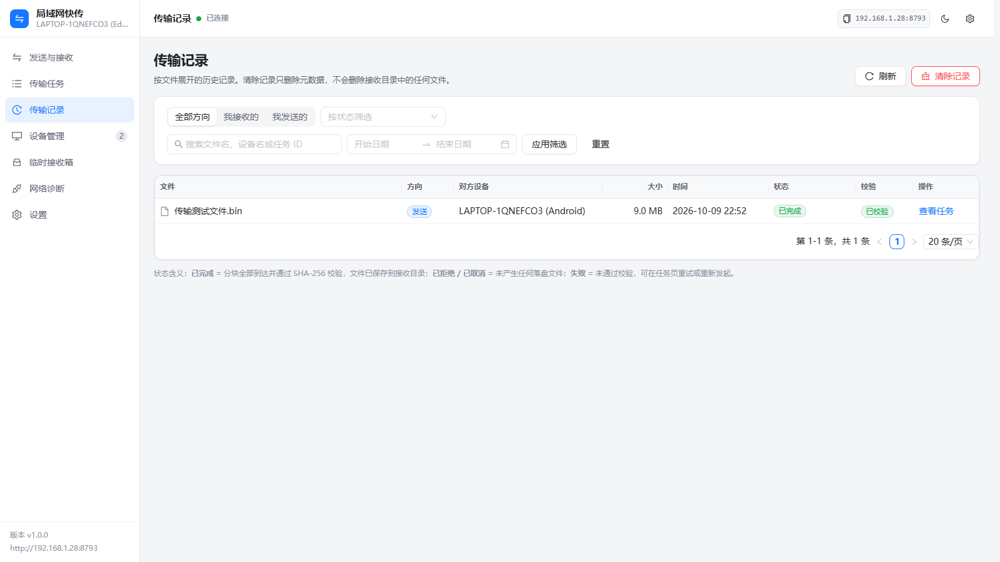
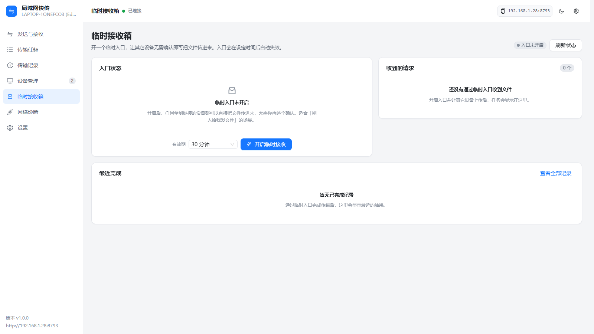
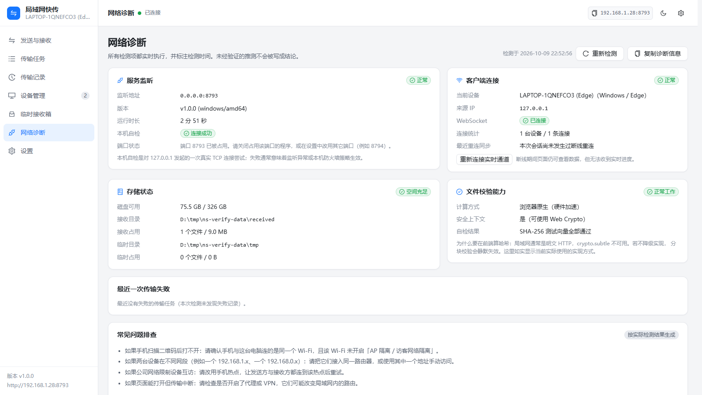
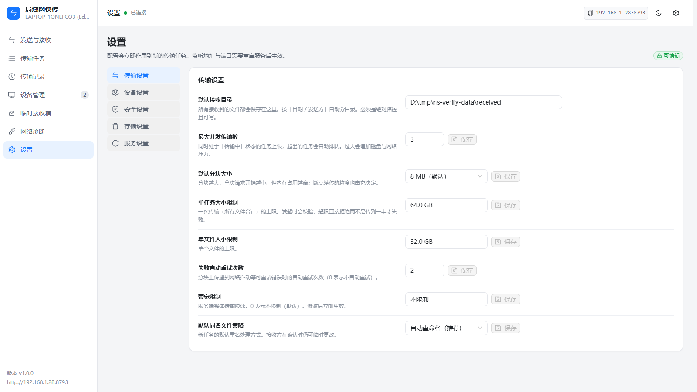
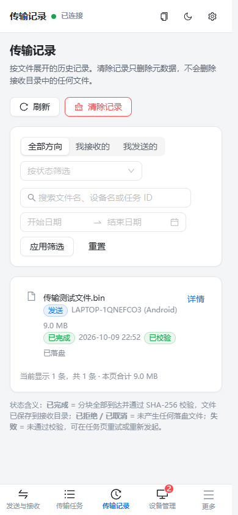
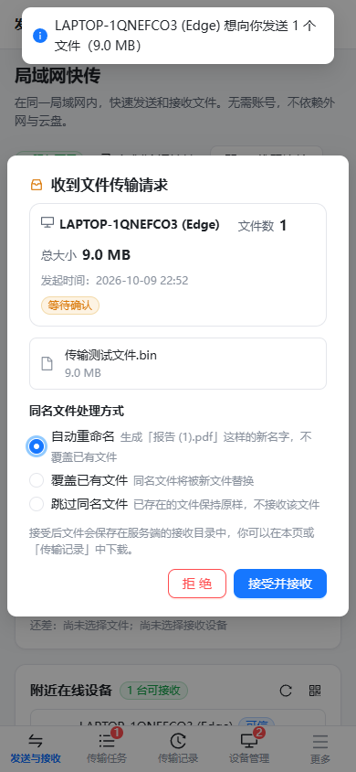

# 局域网快传 · NearSend

在同一个局域网内，**不用数据线、不用微信、不依赖外网和云盘**，让电脑、手机、平板互相传送文件。

一台设备运行本服务，其它设备用浏览器打开它的地址（或扫码）即可收发文件。

```
发送方浏览器  ──分块 HTTP 上传──▶  服务端（Go）  ──校验+原子提交──▶  接收目录
                                        │
接收方浏览器  ◀──授权下载（支持 Range）──┘
```

> **为什么是中转架构？** 浏览器无法接受入站连接，也无法主动扫描局域网设备。
> 因此本服务作为一个「会合点」：所有设备连接到它，由它负责存储、校验与分发。
> 这是浏览器环境下唯一真实可行的模型，本仓库不会为此伪造任何「自动发现」效果。

---

## 界面预览

以下截图来自真实运行的实例（`scripts/ui_check.mjs` 自动采集，非设计稿）。

| 发送与接收（浅色） | 发送与接收（深色） |
| --- | --- |
|  |  |

| 传输任务 | 传输记录 |
| --- | --- |
|  |  |

| 临时接收箱 | 网络诊断 | 设置 |
| --- | --- | --- |
|  |  |  |

| 移动端首页 | 移动端接收确认 |
| --- | --- |
|  |  |

---

## 目录

- [核心特性](#核心特性)
- [技术栈](#技术栈)
- [快速开始](#快速开始)
- [配置项说明](#配置项说明)
- [界面结构](#界面结构)
- [API 概览](#api-概览)
- [WebSocket 事件](#websocket-事件)
- [测试](#测试)
- [安全边界（请务必阅读）](#安全边界请务必阅读)
- [已实现 / 已知限制 / 后续扩展](#已实现--已知限制--后续扩展)

---

## 核心特性

| 能力 | 实现方式 |
| --- | --- |
| 设备在线列表 | 由真实 WebSocket 连接决定；未连接到本服务的设备不会出现，也不伪造 |
| 发送文件 | 拖拽 / 多选 / 文件夹（保留目录结构）、单个或多个接收方 |
| 接收确认 | 默认必须由接收方确认；可对可信设备开启简化确认 |
| 分块传输 | 默认 8 MiB 分块，服务端可配置；全程流式，不把整个文件读进内存 |
| 断点续传 | 服务端记录分块位图，只重传缺失分块；续传前校验源文件是否已变化 |
| 完整性校验 | 每块 SHA-256 + 整文件 SHA-256，全部通过才判定成功 |
| 并发控制 | 传输槽位 + 排队，避免同时跑大量任务把磁盘打满 |
| 取消 / 暂停 / 重试 | 暂停后服务端真的拒绝分块；取消保留已传数据以便续传 |
| 重名策略 | 自动重命名（`报告 (1).pdf`）/ 覆盖 / 跳过，默认绝不静默覆盖 |
| 传输记录 | 按文件展开、可搜索、可按方向与状态筛选、可清空（不动磁盘文件） |
| 临时接收箱 | 有过期时间的免确认入口，过期后由**后端**拒绝，不只是隐藏按钮 |
| 网络诊断 | 真实拨号自检、磁盘探测、JS 哈希实现自检、按检测结果生成排查建议 |
| 主题 | 浅色 / 深色，跟随系统，切换无闪烁 |
| 响应式 | 桌面侧边栏 + 移动端底部标签栏与抽屉；6 种分辨率验证无横向溢出 |

---

## 技术栈

| 层 | 选型 | 说明 |
| --- | --- | --- |
| 后端 | Go 1.24+，标准库 `net/http` | 使用 Go 1.22+ 的方法级路由，不引入 Web 框架 |
| 实时通信 | [gorilla/websocket](https://github.com/gorilla/websocket) | 首帧 `client.hello` 鉴权，令牌不进 URL |
| 元数据 | [modernc.org/sqlite](https://modernc.org/sqlite) | **纯 Go，无 CGO**，单文件数据库，带版本化迁移 |
| 文件存储 | 本地文件系统 | 数据库只存元数据，绝不把二进制塞进 SQLite |
| 二维码 | [skip2/go-qrcode](https://github.com/skip2/go-qrcode) | 服务端生成 PNG，不使用第三方二维码服务 |
| 前端 | React 19 + TypeScript + Vite 8 | 生产构建产物由 Go 服务直接托管，无需额外 Web 服务器 |
| UI | Ant Design 6 | 统一走 antd 组件与 Design Token |
| 状态 | Zustand | 比 Redux 更轻，够用 |
| 路由 | React Router 7 | SPA，Go 侧做 history 回退 |

> **关于前端框架**：任务书建议 Vue 3，但会话中明确要求「使用 React」。因此本项目采用
> React 19 + TypeScript，其余选型（Ant Design、Pinia 对应 Zustand、WebSocket、SQLite、
> 本地文件系统、Go 托管构建产物）与任务书一致。

---

## 快速开始

### 环境要求

- Go **1.24 或更高**（`go.mod` 声明）
- Node.js **20.19+ 或 22.12+**（Vite 8 要求）
- 不需要 CGO / GCC（SQLite 是纯 Go 实现）

### 一、构建并运行（生产模式，推荐）

```bash
# 1) 构建前端（产物在 web/dist）
cd web
npm install
npm run build
cd ..

# 2) 构建后端（产物会自带前端路径探测）
go build -o nearsend ./cmd/nearsend

# 3) 运行
./nearsend
```

启动后控制台会打印可直接访问的地址、接收目录、管理令牌位置：

```
  局域网快传  ·  nearsend v1.0.0
  ─────────────────────────────────────────────
  → http://192.168.1.28:8787   (ipv4, WLAN)
    http://127.0.0.1:8787   (ipv4, Loopback)
  本机访问:     http://127.0.0.1:8787
  ─────────────────────────────────────────────
  接收目录:     <数据目录>/received
  临时目录:     <数据目录>/tmp
  并发/分块:    3 个任务 / 8.0 MB
```

在**本机浏览器**打开 `http://127.0.0.1:8787`（自动获得管理权限），
其它设备打开 `http://<局域网 IP>:8787` 或扫描页面上的二维码。

### 二、开发模式

```bash
# 终端 1：后端
go run ./cmd/nearsend -verbose

# 终端 2：前端（Vite 自动把 /api 与 /ws 代理到 8787）
cd web
npm install
npm run dev
```

开发服务器地址为 `http://localhost:5173`。

### 三、常用参数

```bash
./nearsend -port 9000                 # 换端口（优先级高于数据库中的配置）
./nearsend -addr 127.0.0.1            # 只监听本机
./nearsend -data-dir /path/to/data    # 指定数据目录
./nearsend -public-dir ./web/dist     # 指定前端产物目录
./nearsend -verbose                   # 输出调试日志
./nearsend -version
```

**端口被占用时**，程序会直接给出替代端口与排查命令，而不是抛一个底层错误：

```
  无法启动：监听端口失败
  地址:  0.0.0.0:8787
  原因:  listen tcp 0.0.0.0:8787: bind: ...
  可以尝试：
    1) 换个端口启动：  nearsend -port 8788
    2) 查看占用进程：  Windows: netstat -ano | findstr :8787
```

### 四、打包多平台发行版（用于分发/出售）

```bash
./scripts/build_release.sh
# 或指定版本号
VERSION=v1.2.0 ./scripts/build_release.sh
```

一条命令产出 7 个平台的压缩包到 `release/`：

| 压缩包 | 目标 |
| --- | --- |
| `windows-amd64` | Windows 10/11 64 位（最常用） |
| `windows-arm64` | Windows on ARM |
| `darwin-amd64` | macOS Intel 芯片 |
| `darwin-arm64` | macOS Apple 芯片 |
| `linux-amd64` | Linux 64 位 |
| `linux-arm64` | Linux ARM64 |
| `linux-arm` | Linux ARMv7（树莓派等） |

每个包内自带：程序本体、`web/dist` 前端产物、`使用说明.txt`、一键启动脚本。
由于 SQLite 用的是纯 Go 实现，**交叉编译不需要 CGO / GCC**，
发行包在目标机器上也不需要任何运行库或额外安装。

版本号通过 `-ldflags -X main.version=...` 注入，`/api/health` 与侧边栏会显示它。

打包脚本是幂等的：重复执行只会精确重建自己的产物，不会递归删除整个输出目录。

### 五、部署到局域网服务器

```bash
# Linux 上交叉编译为单文件（前端已包含在 web/dist）
GOOS=linux GOARCH=amd64 go build -o nearsend ./cmd/nearsend
scp -r nearsend web/dist server:~/
# 服务器上
./nearsend -port 8787 -data-dir /srv/nearsend/data
```

需要开机自启时用 systemd 托管即可（`ExecStart=/opt/nearsend/nearsend -data-dir /srv/nearsend/data`）。
防火墙需放行对应 TCP 端口。

---

## 配置项说明

配置保存在 `<数据目录>/nearsend.db` 中，可在**设置页**修改，也可通过 `PATCH /api/settings`。
保存后立即生效的项会被引擎实时同步；**监听地址与端口需要重启服务**，界面上会明确提示。

### 传输设置

| 配置项 | 默认值 | 说明 |
| --- | --- | --- |
| `receiveDir` | `<数据目录>/received` | 收到的文件落盘根目录，按 `日期/发送方` 自动分目录 |
| `maxConcurrentTransfers` | `3` | 同时处于「传输中」的任务上限，超出自动排队 |
| `chunkSize` | `8 MiB` | 分块大小（256 KiB ~ 64 MiB），决定续传粒度 |
| `maxTaskSize` | `64 GiB` | 单次传输总大小上限 |
| `maxFileSize` | `32 GiB` | 单文件大小上限 |
| `autoRetryCount` | `2` | 分块失败自动重试次数（0~10） |
| `bandwidthLimit` | `0`（不限速） | 服务端整体限速（字节/秒） |
| `defaultConflictPolicy` | `rename` | 默认重名策略 |

### 设备设置

| 配置项 | 说明 |
| --- | --- |
| `deviceName` | 服务所在机器的显示名称（也用作本机浏览器会话的默认名） |
| 已信任设备 | 在设备管理页授予/撤销；撤销会立即断开该设备连接 |

### 安全设置

| 配置项 | 默认值 | 说明 |
| --- | --- | --- |
| `allowTrustedAutoAccept` | `false` | 开启后，仅**已受信任**设备发来的文件免确认 |
| `sessionTimeoutSec` | `120` | 会话活跃判定窗口 |
| `trustedTokenTtlHours` | `720` | 信任有效期 |
| `dropboxTtlMinutes` | `30` | 临时入口默认有效期（最大 24 小时） |

### 存储设置

| 配置项 | 默认值 | 说明 |
| --- | --- | --- |
| `tempDir` | `<数据目录>/tmp` | 分块临时目录（不可与接收目录相同） |
| `historyRetentionDays` | `30` | 历史记录保留天数（0 = 永久） |
| `tempRetentionHours` | `24` | 失败/取消任务的临时数据保留时长 |
| `autoCleanTemp` | `true` | 是否自动清理过期临时数据 |

### 服务设置

| 配置项 | 默认值 | 说明 |
| --- | --- | --- |
| `listenAddr` | `0.0.0.0` | `0.0.0.0` 局域网可访问；`127.0.0.1` 仅本机。**需重启** |
| `port` | `8787` | 服务端口。**需重启** |

### 管理令牌

非本机设备要修改设置，必须提供管理令牌：

- 首次启动时打印在控制台；
- 同时写入 `<数据目录>/admin-token.txt`（权限 0600）；
- 在设置页输入一次即可取得管理权限，之后无需重复输入；
- 令牌**从不出现在任何 API 响应中**，也不可通过接口修改。

---

## 界面结构

```
局域网快传
├── 发送与接收      首页：文件拖拽区 + 在线设备 + 当前任务 + 最近传输
├── 传输任务        状态筛选 / 搜索 / 任务详情展开（分块、校验、续传能力）
├── 传输记录        表格（桌面）/ 分组列表（移动）、搜索、方向与状态筛选、清除记录
├── 设备管理        当前在线 / 最近连接 / 已信任，详情抽屉，重命名、信任、断开、移除
├── 临时接收箱      入口状态、剩余时间、二维码、收到的请求、最近完成
├── 网络诊断        服务监听 / 客户端连接 / 存储 / 校验能力 / 最近错误 / 排查建议
└── 设置            传输 / 设备 / 安全 / 存储 / 服务 五组配置
```

另有独立的匿名上传页 `/drop?token=...`（临时接收箱的落地页，不进入主框架）。

**移动端**：隐藏侧边栏，改用底部标签栏（5 个入口）+ 「更多」抽屉（包含全部 7 个页面），
不会因为隐藏侧边栏而丢失任何入口。

---

## API 概览

除标注「公开」外，所有接口都需要 `Authorization: Bearer <session token>`。

| 方法 | 路径 | 说明 |
| --- | --- | --- |
| GET | `/api/health` | **公开** 服务健康状态 |
| POST | `/api/session` | **公开** 登记会话，返回设备与令牌 |
| GET | `/api/qrcode.png` | **公开** 生成当前局域网地址的二维码 PNG |
| GET | `/api/download` | **公开** 凭短期票据下载（支持 Range） |
| GET | `/ws` | **公开** WebSocket（首帧 `client.hello` 鉴权） |
| GET | `/api/config` | 影响客户端行为的公开配置子集 |
| GET | `/api/session/access` | 本机可用地址列表 |
| PATCH | `/api/session` | 修改本机设备名 |
| POST | `/api/session/claim` | 用管理令牌取得管理权限 |
| GET | `/api/devices` | 实时在线设备列表 |
| PATCH | `/api/devices/{id}` | 重命名设备 |
| POST/DELETE | `/api/devices/{id}/trust` | 授予 / 撤销信任（特权） |
| DELETE | `/api/devices/{id}` | 移除设备（特权） |
| POST | `/api/devices/{id}/disconnect` | 断开实时连接（特权） |
| POST | `/api/transfers` | 创建传输请求 |
| GET | `/api/transfers` | 任务列表（支持状态/方向/关键词/分页） |
| GET | `/api/transfers/{id}` | 任务详情 |
| POST | `/api/transfers/{id}/accept` | 接收方确认 |
| POST | `/api/transfers/{id}/reject` | 接收方拒绝 |
| POST | `/api/transfers/{id}/cancel` | 取消 |
| POST | `/api/transfers/{id}/retry` | 重试（保留可续传分块） |
| POST | `/api/transfers/{id}/pause` \| `/resume` | 暂停 / 继续 |
| GET | `/api/transfers/{id}/chunks` | 分块状态与缺失清单（断点续传依据） |
| POST | `/api/transfers/{id}/files/{index}/chunks/{chunk}` | 上传分块（`X-Chunk-SHA256` 可选声明） |
| POST | `/api/transfers/{id}/files/{index}/reset` | 清空某文件分块进度 |
| POST | `/api/transfers/{id}/files/{index}/ticket` | 签发短期下载票据（120 秒） |
| POST | `/api/transfers/{id}/files/{index}/reveal` | 在主机文件管理器中定位（仅回环） |
| GET | `/api/history` | 按文件展开的历史记录 |
| POST | `/api/history/clear` | 清除记录（特权，**不删文件**） |
| GET | `/api/settings` | 完整设置（非特权设备隐去主机路径） |
| PATCH / PUT | `/api/settings` | 更新设置（特权，全量校验） |
| GET | `/api/storage` | 真实存储占用 |
| POST | `/api/storage/cleanup` | 清理临时数据（特权） |
| GET | `/api/diagnostics` | 实时诊断 |
| GET | `/api/dropbox` | 临时入口状态 |
| POST | `/api/dropbox/enable` \| `/disable` | 开启 / 关闭临时入口（特权） |

### 错误响应

统一为 `{"error":{"code":"...","message":"..."}}`。`code` 是稳定的机器可读标识，
前端据此给出「可执行的下一步」而不是一句「操作失败」：

| HTTP | 典型错误码 |
| --- | --- |
| 400 | `bad_request` `invalid_chunk_index` `chunk_hash_mismatch` `invalid_state` `path_traversal` `invalid_file_name` |
| 401 | `unauthorized` `session_expired` |
| 403 | `forbidden` |
| 404 | `not_found` |
| 409 | `conflict_exists` |
| 410 | `dropbox_expired` `not_resumable` |
| 413 | `file_too_large` `task_too_large` |
| 429 | `too_many_concurrent` |
| 507 | `disk_full` |

服务端的绝对路径、密钥与内部堆栈只写入本地日志，**不会**返回给客户端。

---

## WebSocket 事件

事件名在 `internal/protocol/protocol.go` 与 `web/src/lib/ws.ts` 中一一对应。

| 事件 | 触发时机 | 负载要点 |
| --- | --- | --- |
| `server.hello` | 握手成功 | `deviceId` |
| `server.ping` / `server.pong` | 心跳 | — |
| `device.online` / `device.offline` | 真实连接建立/断开 | 完整设备视图 |
| `device.updated` | 重命名、信任变更 | 完整设备视图 |
| `transfer.requested` | 新请求 | `task` |
| `transfer.accepted` / `transfer.rejected` | 接收方动作 | `conflict` / `reason` |
| `transfer.queued` | 槽位状态 | `waiting`（排队中）或 `granted: true`（可开始上传） |
| `transfer.progress` | 节流 350ms | `doneBytes` `totalSize` `files[]` |
| `transfer.file.completed` | 单文件校验通过 | `fileIndex` `finalName` |
| `transfer.completed` | 全部分块校验通过 | `task` |
| `transfer.failed` | 失败 | `code` `message` `resumable` |
| `transfer.cancelled` / `paused` / `resumed` / `retrying` | 对应操作 | — |
| `dropbox.changed` / `settings.changed` | 状态变化 | — |

**断线重连**：客户端指数退避重连；重连成功后**主动重新拉取**设备、任务、配置与地址，
不复用内存中的旧数据。

---

## 测试

### 后端自动化测试

```bash
go test ./...              # 全部
go test ./internal/transfer -v   # 传输引擎（分块、续传、校验、权限、清理）
go test ./internal/api -v        # HTTP 层（鉴权、越权、WebSocket、端到端）
go test ./internal/fsutil -v     # 路径安全、重名策略、原子提交、哈希
```

覆盖范围（详见各测试文件中的用例名）：

- 设备上线/下线、UA 解析与设备分类、同名设备会话隔离
- 创建/接受/拒绝、等待确认与离线设备提示
- **越权**：第三方查看/取消/上传/下载/改设置/清历史一律 403
- **分块**：重复提交幂等、缺失分块报告、非法索引、超长请求体、哈希不符
- **完整性**：单块哈希、整文件哈希、失败任务绝不标记成功
- **续传**：重启恢复保留分块进度、只重传缺失部分、源文件变化时重置
- **路径安全**：`../` 逃逸、绝对路径注入、符号链接逃逸、保留设备名、超长名
- **重名**：rename 递增命名、overwrite 覆盖、skip 跳过且不改动原文件
- **并发**：槽位限制与排队、僵死任务回收并释放槽位
- **持久化**：关闭重开数据库后状态与分块进度完整保留
- **临时入口**：开启 → 免确认上传 → 关闭后后端强制拒绝
- 清理策略：进行中的任务绝不被清理；已完成任务的残留目录可回收

### 端到端验收（真实文件）

先启动服务，然后：

```bash
python scripts/e2e_test.py http://127.0.0.1:8787
```

脚本会在内存中生成一个 20 MiB 的真实文件，完整走一遍
创建 → 确认 → 分块上传 → 校验 → 下载 → 逐字节比对，并额外验证越权、临时入口、
设置校验与「清除历史不删文件」。**会自动用服务端枚举的局域网地址创建第二个会话**，
以验证跨设备授权（从 `127.0.0.1` 访问的会话是主机自身，无法用来测越权）。

最近一次运行结果：**66 项全部通过**，20 MiB 分 3 块上传耗时约 0.26 秒（≈ 77 MB/s）。

### UI 巡检（真实浏览器）

```bash
mkdir -p /tmp/ns-ui && cd /tmp/ns-ui && npm install playwright-core
cp <repo>/scripts/ui_check.mjs .
node ui_check.mjs                 # 需先启动服务
```

用系统自带 Edge 驱动两个上下文（桌面 1600×900 + 手机 390×844），实际完成
「拖入文件 → 选择设备 → 发送 → 手机端收到请求 → 接受 → 传输完成 → 手机端下载」，
并逐页检查渲染、JS 报错、横向溢出、深色主题对比度与移动端导航。

最近一次运行结果：**52 项检查、0 个问题**。覆盖 1920×1080 / 1440×900 / 1024×768 /
768×1024 / 390×844 / 360×800 六种分辨率均无横向溢出；深色主题各元素对比度均 ≥ 4.5:1。

输出目录可用 `OUT_DIR` 指定，服务地址用 `BASE` 指定：

```bash
BASE=http://127.0.0.1:8787 OUT_DIR=./shots node ui_check.mjs
```

---

## 安全边界（请务必阅读）

### 已实现的服务端控制

1. **令牌鉴权**：所有写操作校验 `Bearer` 会话令牌；令牌由服务端随机生成，客户端无法指定。
2. **任务授权**：只有发送方可以上传分块，只有接收方可以接受/拒绝/下载；
   任何第三方访问任务详情、签发票据、取消任务都会被 403 拒绝。
3. **下载票据**：浏览器原生下载无法携带请求头，因此使用**短时效（120 秒）、
   绑定任务+文件+设备**的票据，而不是把会话令牌放进 URL。
4. **文件名与路径**：所有文件名经净化（去除分隔符、控制字符、`..`、Windows 保留名），
   所有落盘路径经 `SafeJoin` 校验必须位于受控根目录内，并检测符号链接逃逸。
5. **先校验后落盘**：分块 SHA-256 校验通过才写入临时文件；整文件校验通过才原子提交为最终文件。
6. **特权分离**：修改设置、信任管理、清除记录、清理临时文件需要特权设备。
   特权来源只有两条：请求来自主机回环地址，或该设备已被授予信任
   （由特权设备授权，或凭管理令牌一次性认领）。**刻意不提供「无信任设备时自动放行」的兜底。**
7. **目录隔离**：临时目录与接收目录强制不同；清理逻辑只动临时目录，绝不删除接收目录中的文件。
8. **输入校验**：请求体大小受限、未知 JSON 字段被拒绝、分块索引与大小在服务端校验。
9. **稳定错误码**：统一错误结构，不泄露绝对路径、SQL 语句或堆栈。

### 传输加密边界（重要）

本服务通过**明文 HTTP** 在局域网内提供访问，**没有启用 TLS，因此不具备端到端加密能力**。
同一网络中的其它设备在理论上可以嗅探传输内容。

- 请仅在可信的局域网中使用（例如你自己的家庭网络）。
- **不要**在公共 Wi-Fi 或不受信任的网络上传输敏感文件。
- 若必须在不可信网络使用，请自行在服务前置 TLS 反向代理，或改用 VPN。

本项目**不会**声称任何未实现的加密能力。诊断页与设置页都会明确显示这条提示。

### 临时接收箱的边界

临时入口在有效期内**免确认**接收，任何拿到链接的人都能上传。它仍然受以下约束，且全部由后端强制执行：

- 令牌有绝对过期时间，过期或被手动关闭后，后端立即拒绝其一切请求（返回 `dropbox_expired`）；
- 仍然受接收目录、重名策略、单文件/单任务大小限制约束；
- 重新签发会让旧地址立即失效；
- 默认有效期 30 分钟，最大 24 小时。

因此它**不是**一个永久、无鉴权的上传接口。

---

## 已实现 / 已知限制 / 后续扩展

### 已实现（可直接使用）

- 设备会话登记、实时在线状态、重命名、信任管理、移除与强制断开
- 二维码连接、局域网地址枚举与复制、手动输入地址
- 多文件 / 文件夹（保留目录结构）/ 拖拽发送，单个或多个接收方
- 接收方确认（重名策略三选一）、拒绝并回传原因
- 8 MiB 分块传输、流式读写、限速、传输槽位与排队
- 断点续传（含源文件变化检测与重置）、取消、暂停、重试
- 每块与整文件 SHA-256 校验，未通过绝不判定成功
- 重名自动重命名 / 覆盖 / 跳过
- 传输记录（搜索、方向与状态筛选、分页、清除不删文件）
- 临时接收箱（后端强制过期）、匿名上传页
- 网络诊断（真实自检、磁盘探测、哈希能力自检、针对性建议）
- 五组配置项，热生效与需重启的区分提示
- 浅色/深色主题、响应式布局、动画规范与 `prefers-reduced-motion`
- 自动化测试 + 端到端验收 + 真实浏览器 UI 巡检脚本

### 已知限制（如实说明）

1. **没有原生局域网设备自动发现**。浏览器无法扫描局域网，因此设备列表只显示
   真实连接到本服务的客户端。原生发现能力需要独立的 mDNS/SSDP 客户端程序，
   本仓库未实现（见下「后续扩展」，发现协议与 Web 注册机制已解耦，便于扩展）。
2. **页面刷新后无法继续上传**。源 `File` 对象只存在于页面内存中，刷新即失效。
   此时界面会明确提示「请重新选择文件」，而不是假装还在续传。
   （已上传到服务端的分块仍然保留，重新选择同名同大小文件后可续传。）
3. **移动浏览器后台限制**。页面切到后台或系统休眠后，浏览器可能暂停 JS 执行，
   导致上传停滞。界面会提示保持前台；移动端浏览器无法保证后台持续传输。
4. **服务端中转**。文件会先完整存到运行服务的机器上，接收方再下载，
   因此需要该机器有足够磁盘空间（占用情况可在设置页查看）。
5. **明文 HTTP**，不具备端到端加密（见上）。
6. **重名文件夹采用合并策略**（与解压行为一致），不会为同名目录再建一层。
7. **并发槽位回收阈值**为 10 分钟无进展；期间若发送方消失，该任务会一直占着槽位直到被回收。
8. 单个浏览器会话的下载一次只触发一个文件，多文件任务会依次触发下载。

### 后续扩展方向

- **原生设备发现**：独立守护进程用 mDNS/DNS-SD 广播服务实例，与现有 Web 注册机制并行，
  发现结果通过 `POST /api/devices/advertise` 登记（协议层已预留分离空间）。
- **TLS**：可选的 HTTPS 监听 + 自签证书分发，使 Web Crypto 可用并保护传输内容。
- **多文件夹批量操作**：目录级的选择/暂停/清除。
- **任务分组**：把一次「多接收方发送」聚合成一个父任务，统一展示进度。
- **断点续传持久化到浏览器**：用 IndexedDB 保存分块哈希与源文件指纹，
  使刷新后可以用 `File System Access API` 重新选择同一文件并快速校验续传。

---

## 仓库结构

```
.
├── cmd/nearsend/main.go          程序入口：参数解析、启动、优雅关闭、端口占用提示
├── internal/
│   ├── api/                      HTTP 路由、会话鉴权、全部 REST 处理函数、静态托管
│   ├── config/                   配置默认值、校验、热更新与管理令牌
│   ├── fsutil/                   文件名净化、路径逃逸防护、重名策略、原子提交、SHA-256
│   ├── hub/                      WebSocket 连接管理、心跳、在线状态广播
│   ├── model/                    领域模型（前后端协议的一部分）
│   ├── netinfo/                  局域网地址枚举、端口探测、诊断建议
│   ├── protocol/                 WebSocket 事件名与稳定错误码（前后端唯一真相）
│   ├── store/                    SQLite 数据访问层与版本化迁移
│   └── transfer/                 传输引擎：分块、续传、校验、槽位调度、清理
├── web/                          React + TypeScript + Vite 前端
│   ├── src/lib/                  API 客户端、WebSocket、SHA-256（含降级）、上传引擎
│   ├── src/store/                Zustand 状态（会话、设备、任务、配置、主题）
│   ├── src/components/           布局与复用组件
│   ├── src/pages/                七个业务页面 + 匿名上传页
│   └── src/styles/               设计令牌、基础样式、动画规范、布局
├── scripts/
│   ├── build_release.sh          多平台发行版打包（7 个平台，含启动脚本与说明）
│   ├── e2e_test.py               端到端验收脚本
│   └── ui_check.mjs              真实浏览器 UI 巡检脚本
├── release_assets/               发行包内的模板文件（使用说明与启动脚本）
├── 发布文案/                     商品图文素材（闲鱼文案等）
└── docs/                         架构、安全、关键决策说明、界面截图
```

---

## 许可

未指定许可证。默认按个人/内部使用对待。
